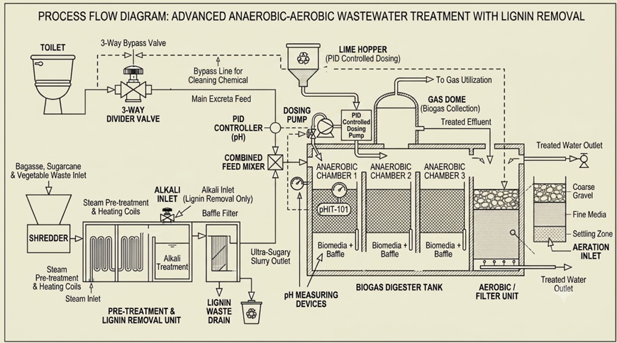
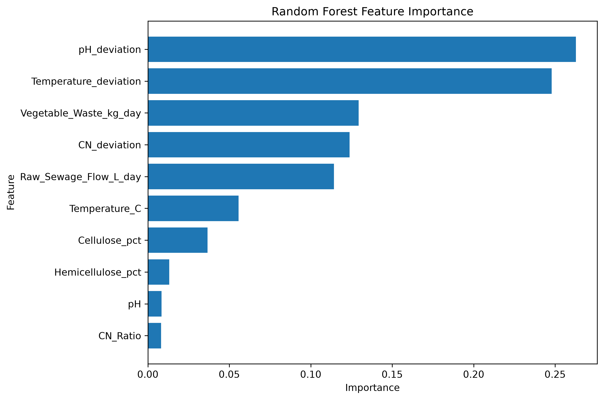
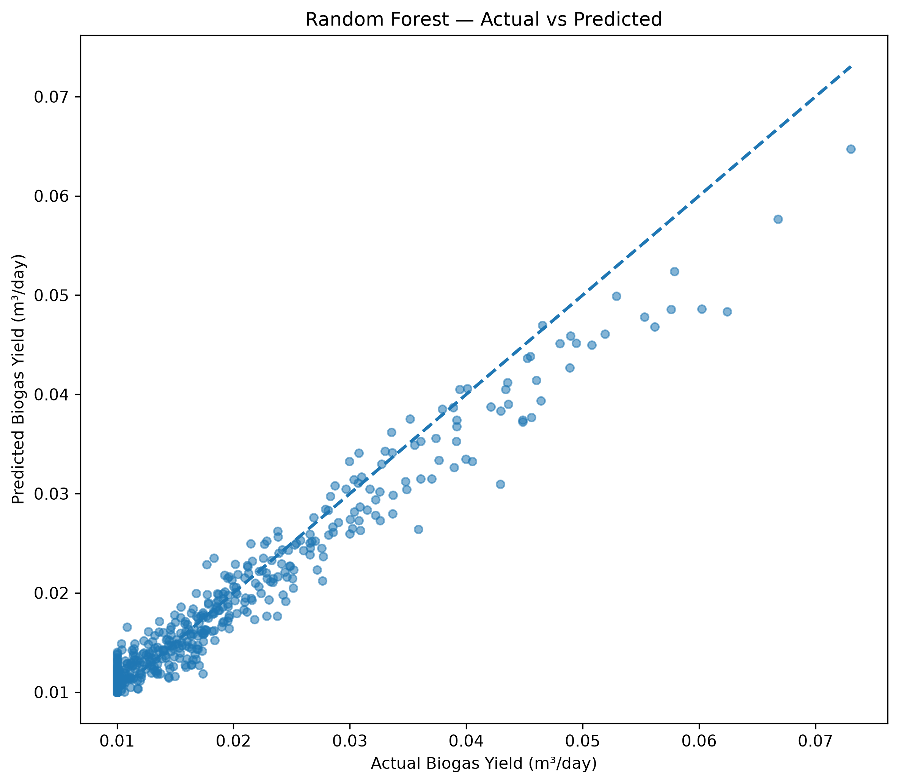
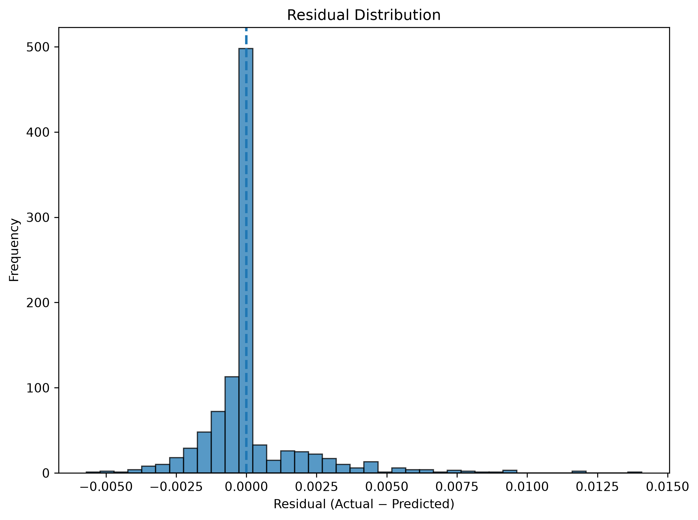
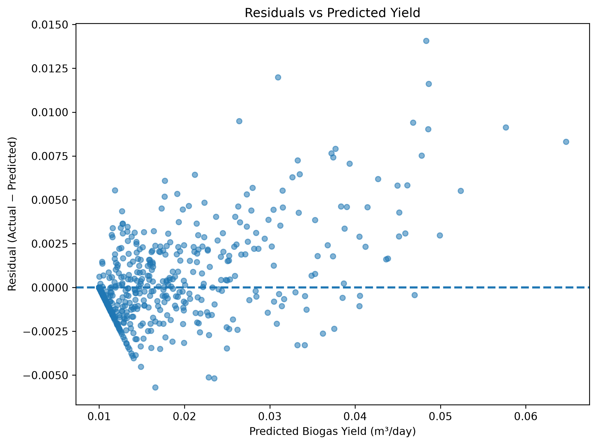

# 🌿 AUDST Biogas Prediction & Analytics

<div align="center">

### Physics-Informed Random Forest Modeling for Anaerobic Upflow Domestic Septic Tank (AUDST) Biogas Yield

**IIT Patna · Engineering + Machine Learning Project · 2026**

[](https://www.python.org/)
[](https://scikit-learn.org/)
[](https://streamlit.io/)
[](https://plotly.com/)
[](https://git-lfs.com/)

**AUDST Design → Synthetic Process Modeling → Model Benchmarking → Physics-Informed Feature Engineering → RF Optimization → Validation → Interactive Dashboard**

</div>

---

## 📌 Project Overview

This repository presents an integrated engineering and machine-learning framework for **daily biogas-yield prediction in an Anaerobic Upflow Domestic Septic Tank (AUDST)** concept.

The project combines:

- an engineering representation of decentralized anaerobic wastewater treatment,
- a reproducible **synthetic process dataset**,
- a phenomenological/physics-inspired biogas response formulation,
- systematic comparison of multiple regression algorithms,
- physics-informed feature engineering,
- Random Forest feature ablation and hyperparameter optimization,
- held-out test-set validation and residual analysis, and
- an interactive **Streamlit prediction and analytics dashboard**.

The final predictive pipeline uses an **optimized Random Forest Regressor** with 10 model features and achieves:

| Metric | Final Result |
|---|---:|
| **Test R²** | **0.9566** |
| **Test RMSE** | **0.001854 m³/day** |
| **Test MAE** | **0.000966 m³/day** |
| **5-fold CV R²** | **0.95897 ± 0.00338** |
| Training samples | 4,000 |
| Held-out test samples | 1,000 |
| Final model features | 10 |
| Number of trees | 1,000 |

> **Important scientific scope:** the dataset used in this repository is **synthetically generated**, not experimentally measured. The reported model performance therefore demonstrates performance on the defined synthetic process-generating mechanism and should **not** be interpreted as experimental validation of an actual AUDST reactor.

---

## 🎯 Problem Statement

Conventional domestic septic systems primarily provide wastewater containment and partial treatment. They generally do not exploit the organic fraction of wastewater and co-substrates as a structured renewable-energy resource.

The project investigates a conceptual AUDST framework in which:

**Domestic wastewater + vegetable waste**

→ **pretreatment / substrate conditioning**

→ **anaerobic digestion**

→ **biogas recovery**

→ **aerobic polishing**

while a data-driven model estimates expected daily biogas yield from operating conditions.

The computational objective is:

> **Given a set of AUDST process conditions, estimate daily biogas production and expose the operating variables that most strongly influence the model prediction.**

---

## 🧠 Core Idea

The repository is deliberately structured as a **model-development study**, not merely a single trained model.

### Development path

```text
Synthetic Process Generator
          │
          ▼
   5,000 Process Samples
          │
          ▼
 ┌───────────────────────────┐
 │ Baseline Model Benchmark  │
 │ XGB / SVR / GB / RF / ET  │
 │ KNN / Decision Tree       │
 └───────────────────────────┘
          │
          ▼
 Random Forest Investigation
          │
          ▼
 Physics-Informed Features
          │
          ├── Temperature deviation
          ├── pH deviation
          └── C/N deviation
          │
          ▼
      Feature Ablation
          │
          ▼
   Hyperparameter Search
          │
          ▼
 Optimized Random Forest
          │
          ▼
 Untouched 20% Test Set
          │
          ▼
 Residual + Sensitivity Analysis
          │
          ▼
 Streamlit Decision-Support Dashboard
```

---

# 🏗️ AUDST Engineering Concept

The broader engineering concept is a decentralized wastewater-treatment and resource-recovery system built around anaerobic digestion.



### Conceptual process chain

```text
Domestic Wastewater
        +
Organic / Vegetable Waste
        │
        ▼
 Pretreatment / Conditioning
        │
        ▼
 Multi-Chamber Anaerobic Digestion
        │
        ├──────────────► Biogas Recovery
        │
        ▼
 Anaerobic Effluent
        │
        ▼
 Aerobic / Polishing Treatment
        │
        ▼
 Treated Effluent
```

The reactor architecture, pretreatment strategy and polishing stage form the engineering context for the predictive model.

---

# 📊 Dataset

## Dataset type

**Synthetic, seeded and reproducible**

The dataset is generated by `generate.py` using:

- **5,000 samples**
- fixed random seed: **42**
- explicit engineering units
- bounded operating ranges
- a nonlinear biological response envelope
- controlled Gaussian noise

### Generated variables

| Variable | Range / Generation |
|---|---|
| Digester volume | 5–500 m³ |
| HRT | 35–45 days |
| Raw sewage flow | derived from (Q=V/HRT) |
| Vegetable waste | 10–300 kg/day |
| Cellulose | approximately 35–55% |
| Hemicellulose | approximately 18–28% |
| Temperature | 25–40 °C |
| pH | 6.8–7.6 |
| C/N ratio | 20–25 |
| Biogas yield | generated target, m³/day |
| Methane | generated gas-quality indicator |
| CO₂ | generated gas-quality indicator |

The dataset is saved as:

```text
BiogasData.csv
```

---

# 🧪 Synthetic Biogas-Generation Mechanism

The generator encodes nonlinear process behavior through environmental response functions.

### Temperature response

[
f_T =
expleft[
-left(rac{T-35}{5}
ight)^2

ight]
]

### pH response

[
f_{pH} =
expleft[
-left(rac{pH-7.2}{0.3}
ight)^2

ight]
]

### C/N response

[
f_{C/N} =
expleft[
-left(rac{C/N-22.5}{2.5}
ight)^2

ight]
]

### HRT response

[
f_{HRT}=1-expleft(-rac{HRT}{10}
ight)
]

### Combined environmental efficiency

$\eta_{env}=f_T\,f_{pH}\,f_{C/N}\,f_{HRT}$

The target is generated using a nonlinear feed/flow relationship with vegetable-waste, cellulose and hemicellulose contributions, followed by approximately 4% relative Gaussian noise and a lower yield floor.

This design creates a controlled environment in which nonlinear regression models can be compared and tested.

> **Why this matters:** because the target is generated from known mathematical structure, model performance measures how well the algorithms recover the relationships embedded in the synthetic mechanism. It is not equivalent to validation against plant measurements.

---

# 🤖 Machine-Learning Pipeline

## 1. Baseline Model Benchmark

The first experiment compares seven regression families using **5-fold cross-validation** on the original engineering feature representation.

### Baseline results

| Model | R² | RMSE (m³/day) | MAE (m³/day) |
|---|---:|---:|---:|
| **XGBoost** | **0.95094** | **0.002004** | **0.001293** |
| **SVR** | **0.95011** | **0.002014** | **0.001477** |
| Gradient Boosting | 0.92662 | 0.002449 | 0.001520 |
| Extra Trees | 0.91463 | 0.002642 | 0.001538 |
| Random Forest | 0.91084 | 0.002700 | 0.001556 |
| KNN | 0.78201 | 0.004223 | 0.002508 |
| Decision Tree | 0.77025 | 0.004314 | 0.002222 |

### Important interpretation

XGBoost is the strongest **baseline** model in this experiment.

The final pipeline does **not** claim that the initial Random Forest was the best algorithm. Instead, the project investigates whether the Random Forest can be substantially improved through a more appropriate feature representation and systematic tuning.

---

# 🧬 Physics-Informed Feature Engineering

The original engineering feature representation was expanded using domain-inspired transformations.

### Base predictive variables

The final RF uses seven direct process variables:

1. Raw sewage flow
2. Vegetable waste
3. Cellulose
4. Hemicellulose
5. Temperature
6. pH
7. C/N ratio

### Engineered variables

Three additional features encode distance from the modeled biological optima:

$\Delta T = |T-35|$

$\Delta pH = |pH-7.2|$

$\Delta(C/N)=|C/N-22.5|$

Therefore:

$\boxed{7\text{ base features}+3\text{ engineered features}=10\text{ final model features}}$

---

# 🔬 Why These Features Were Selected

The synthetic generator explicitly defines optimal response centers around:

- **35 °C**
- **pH 7.2**
- **C/N = 22.5**

Distance-from-optimum features give the Random Forest an explicit representation of these nonlinear operating envelopes.

This was tested rather than assumed.

### Feature-engineering experiment

| Feature representation | Features | CV R² |
|---|---:|---:|
| Original | 7 | 0.91865 |
| Expanded physics-inspired set | 18 | 0.95794 |

### Ablation study

The ablation study showed that the compact deviation representation was nearly as strong as the full 18-feature representation:

| Feature set | Features | CV R² |
|---|---:|---:|
| Original 7 | 7 | 0.91865 |
| Base + deviations | **10** | **0.95783** |
| All engineered features | 18 | 0.95785 |

This motivated the final **10-feature representation**: nearly the full engineered performance with substantially fewer engineered variables.

---

# ⚙️ Random Forest Hyperparameter Optimization

The final RF search evaluates **138 configurations** using 5-fold cross-validation.

The search varies:

- number of trees,
- maximum depth,
- minimum samples per split,
- minimum samples per leaf,
- feature subsampling,
- split criterion.

### Selected configuration

```text
RandomForestRegressor(
    n_estimators=1000,
    max_depth=20,
    min_samples_split=2,
    min_samples_leaf=1,
    max_features=0.8,
    criterion="poisson",
    random_state=42,
    n_jobs=-1
)
```

### Cross-validation result

| Metric | Result |
|---|---:|
| CV R² | **0.958974** |
| CV R² Std | **0.003375** |
| CV RMSE | **0.001836 m³/day** |
| CV MAE | **0.000987 m³/day** |

---

# 🏆 Final Held-Out Evaluation

After model selection, the final model is trained on:

- **4,000 samples**
- **10 final features**

and evaluated on an untouched:

- **1,000-sample test set**

using `train_test_split(test_size=0.20, random_state=42)`.

### Final test performance

| Metric | Result |
|---|---:|
| **R²** | **0.956615** |
| **RMSE** | **0.001854 m³/day** |
| **MAE** | **0.000966 m³/day** |

### Interpretation

The final model explains approximately **95.7% of the variance in the held-out synthetic target** under the defined data-generating mechanism.

The small difference between cross-validation and held-out performance indicates stable generalization within this synthetic dataset.

---

# 📌 Final Feature Importance

The final Random Forest reports the following impurity-based feature importances:

| Rank | Feature | Importance |
|---:|---|---:|
| 1 | **pH deviation** | **26.27%** |
| 2 | **Temperature deviation** | **24.79%** |
| 3 | Vegetable waste | **12.94%** |
| 4 | C/N deviation | **12.39%** |
| 5 | Raw sewage flow | **11.42%** |
| 6 | Temperature | 5.57% |
| 7 | Cellulose | 3.67% |
| 8 | Hemicellulose | 1.31% |
| 9 | pH | 0.84% |
| 10 | C/N ratio | 0.81% |



### Interpretation

The model relies most heavily on the engineered deviation features, particularly pH and temperature deviation.

This should be interpreted as **model behavior within the synthetic data-generating framework**, not as experimental evidence of causal importance in a physical AUDST reactor.

---

# 📉 Residual Analysis

The repository performs a dedicated residual analysis rather than relying only on R².

### Overall residual statistics

- Mean residual: **0.000143 m³/day**
- Median residual: **−0.0000167 m³/day**
- MAE: **0.000966 m³/day**
- Mean relative error: **5.49%**
- Median relative error: **2.11%**
- 90th percentile relative error: **15.60%**
- 95th percentile relative error: **20.48%**
- Maximum relative error: **52.49%**

The test set contains:

- **402 under-predictions**
- **598 over-predictions**

The mean residual is slightly positive, indicating a small overall tendency toward underprediction in the defined residual convention (Actual-Predicted).

### Error increases in sparse high-yield regions

| Yield band | Samples | MAE | Mean Relative Error |
|---|---:|---:|---:|
| Very Low | 876 | 0.000624 | 4.93% |
| Low | 78 | 0.002414 | 8.75% |
| Medium | 31 | 0.004053 | 9.82% |
| High | 12 | 0.006181 | 11.40% |
| Very High | 3 | 0.010512 | 15.88% |

The high-yield region contains very few test observations, so its larger errors should be interpreted in the context of sparse synthetic coverage.

### Validation plots







---

# 🎛️ Sensitivity Analysis

The dashboard and validation workflow investigate the response of the trained model to individual process variables while holding the remaining inputs constant.

Validated trends include:

### Temperature

Predicted yield peaks around the modeled optimum near **35 °C** and decreases toward the edges of the operating range.

### pH

Predicted yield peaks near **pH 7.2** and decreases away from the modeled optimum.

### C/N

Predicted yield peaks around **C/N 22.5** and decreases toward the boundaries.

### Vegetable waste

Predicted yield generally increases as vegetable-waste loading increases within the synthetic operating range.

### Hydraulic flow

Predicted yield generally increases with flow over the tested range.

The sensitivity results are useful for understanding model response, but they are **not causal experiments**.

---

# 🖥️ Interactive Streamlit Dashboard

The application is implemented in `main.py`.

### Dashboard capabilities

- Daily biogas-yield prediction
- Multiple sewage-flow input units
- Vegetable-waste unit conversion
- Digester utilization check
- Gas composition estimation
- Methane / CO₂ output conversion
- Operating-condition assessment
- Feature importance
- Parameter sensitivity curves
- Correlation heatmap
- Actual-vs-predicted validation plot
- Biological-stage interpretation
- Design-oriented calculations

### Important implementation detail

The dashboard accepts engineering inputs including:

- digester volume,
- raw sewage flow,
- vegetable waste,
- cellulose,
- hemicellulose,
- temperature,
- pH,
- HRT,
- C/N.

However, the **final RF prediction vector contains 10 features**:

```text
Raw_Sewage_Flow_L_day
Vegetable_Waste_kg_day
Cellulose_pct
Hemicellulose_pct
Temperature_C
pH
CN_Ratio
Temperature_deviation
pH_deviation
CN_deviation
```

Digester volume and HRT are used by the dashboard for engineering/design calculations, but they are **not part of the final RF feature vector**.

---

# ⚠️ Physics Model vs Final ML Prediction

The repository contains a phenomenological physics-style calculation in `main.py`.

It is retained as an **engineering reference**, not as a blended production prediction.

The final application prediction is:

```python
final_prediction = ml_prediction
```

Therefore the deployed dashboard does **not** use the old 95% ML + 5% physics blending scheme.

This distinction is intentional and should be preserved when extending the project.

---

# 📁 Repository Structure

```text
Biogas/
│
├── main.py
│   └── Streamlit dashboard and final RF inference pipeline
│
├── generate.py
│   └── Reproducible synthetic dataset generator
│
├── BiogasData.csv
│   └── 5,000-row synthetic dataset
│
├── biogas_model_final.pkl
│   └── Final Random Forest model (Git LFS)
│
├── model_comparison.py
├── model_comparison.csv
│   └── Baseline 5-fold model benchmark
│
├── rf_feature_engineering.py
├── rf_feature_engineering_results.csv
│   └── Physics-informed feature engineering experiment
│
├── rf_feature_ablation.py
├── rf_feature_ablation_results.csv
│   └── Feature-group ablation study
│
├── rf_final_tuning.py
├── rf_final_tuning_results.csv
│   └── Final Random Forest hyperparameter search
│
├── sensitivity_validation.py
│   └── Independent sensitivity checks
│
├── final_model.py
│   └── Final training + held-out test evaluation
│
├── final_analysis.py
│   └── Residual and yield-band analysis
│
├── final_visualizations.py
│   └── Publication-style validation plots
│
├── final_feature_importance.csv
├── final_parity_data.csv
├── final_residual_analysis.csv
├── error_by_yield_band.csv
│   └── Final analysis artifacts
│
├── final_feature_importance.png
├── final_parity_plot.png
├── final_residual_distribution.png
├── final_residual_vs_prediction.png
│   └── Final evaluation visualizations
│
├── AUDST.png
├── AUDST2.png
│   └── AUDST engineering visuals
│
├── biogas_ai.py
│   └── Legacy baseline CLI experiment
│
├── feature_ablation.py
├── hydraulic_ablation.py
├── optimize_rf.py
│   └── Earlier exploratory experiments
│
├── requirements.txt
├── .gitignore
└── .gitattributes
```

---

# 🚀 Reproducible Setup

## 1. Clone the repository

```bash
git clone https://github.com/hetram1/Biogas.git
cd Biogas
```

## 2. Create a virtual environment

```bash
python -m venv .venv
source .venv/bin/activate
```

On Windows PowerShell:

```powershell
.venv\Scripts\Activate.ps1
```

## 3. Install core dependencies

```bash
pip install --upgrade pip
pip install -r requirements.txt
```

The dashboard and final-model pipeline use the packages pinned in `requirements.txt`.

### Optional dependency for baseline XGBoost comparison

The baseline comparison script uses XGBoost:

```bash
pip install xgboost
```

This dependency is only required when running `model_comparison.py` and the older XGBoost-based exploratory experiments.

---

# 🔬 Complete Research Workflow

Run the following sequence when reproducing the complete modeling study.

## Step 1 — Generate the dataset

```bash
python generate.py
```

Creates:

```text
BiogasData.csv
```

---

## Step 2 — Benchmark regression algorithms

```bash
python model_comparison.py
```

Creates:

```text
model_comparison.csv
```

---

## Step 3 — Test physics-informed feature engineering

```bash
python rf_feature_engineering.py
```

Creates:

```text
rf_feature_engineering_results.csv
```

---

## Step 4 — Run RF feature ablation

```bash
python rf_feature_ablation.py
```

Creates:

```text
rf_feature_ablation_results.csv
```

---

## Step 5 — Optimize the final Random Forest

```bash
python rf_final_tuning.py
```

Creates:

```text
rf_final_tuning_results.csv
```

---

## Step 6 — Validate sensitivity behavior

```bash
python sensitivity_validation.py
```

---

## Step 7 — Train and evaluate the final model

```bash
python final_model.py
```

Creates:

```text
biogas_model_final.pkl
final_parity_data.csv
final_feature_importance.csv
```

---

## Step 8 — Run residual analysis

```bash
python final_analysis.py
```

Creates:

```text
final_residual_analysis.csv
error_by_yield_band.csv
```

---

## Step 9 — Generate final plots

```bash
python final_visualizations.py
```

Creates:

```text
final_parity_plot.png
final_residual_distribution.png
final_residual_vs_prediction.png
final_feature_importance.png
```

---

## Step 10 — Launch the dashboard

```bash
streamlit run main.py
```

The application loads:

```text
biogas_model_final.pkl
final_feature_importance.csv
BiogasData.csv
final_parity_data.csv
AUDST.png
```

---

# 🧮 Final Model Specification

### Input transformation

```text
7 direct predictive variables
        +
3 physics-informed deviation variables
        =
10-feature RF representation
```

### Model

```text
Algorithm      : Random Forest Regressor
Trees          : 1000
Maximum depth  : 20
Min split      : 2
Min leaf       : 1
Max features   : 0.8
Criterion      : Poisson
Random state   : 42
Parallelism    : n_jobs=-1
```

### Target

```text
Biogas_Yield_m3_day
```

---

# 📈 What the Results Actually Demonstrate

The modeling study supports the following conclusions **within the synthetic data framework**:

1. Tree-based and kernel regression models can learn the nonlinear target relationship effectively.
2. XGBoost and SVR were the strongest baseline models under the original feature representation.
3. Random Forest performance improved substantially after introducing physics-informed deviation features.
4. A compact 10-feature representation was nearly as effective as a larger 18-feature engineered representation.
5. Hyperparameter optimization further improved the Random Forest.
6. The final RF achieved **0.9566 R² on an untouched test set**.
7. Model errors increase in sparse high-yield regions.
8. Feature importance is dominated by the engineered pH and temperature deviation features.
9. The Streamlit dashboard provides a practical interface for model inference and exploratory sensitivity analysis.

---

# ⚠️ Limitations

This project is a **research/engineering prototype**, not a validated commercial reactor model.

### 1. Synthetic data

The 5,000 observations are generated by `generate.py`. They are not measurements from an operating AUDST.

### 2. No pilot-scale validation

The AUDST architecture has not been validated through pilot-scale experimental operation in this repository.

### 3. Model-generator relationship

The engineered deviation features intentionally mirror structure embedded in the synthetic generator. This improves learning within the synthetic environment but introduces a risk of circularity if interpreted as independent experimental discovery.

### 4. Feature importance is not causality

Random Forest feature importance describes how the fitted model uses variables; it does not establish causal biological importance.

### 5. High-yield region is sparse

Only a small number of test observations occur in the highest yield bands, resulting in larger relative prediction errors there.

### 6. No real-time sensing

The dashboard is not connected to live reactor sensors.

### 7. No autonomous control

The system predicts and analyzes; it does not automatically manipulate reactor operating conditions.

---

# 🔭 Future Work

The next engineering and research stages are:

### Experimental validation
- laboratory BMP experiments,
- pilot-scale AUDST fabrication,
- measured biogas and methane production,
- COD/BOD/VSS removal characterization.

### Sensor integration
- temperature,
- pH,
- flow,
- gas pressure,
- CH₄ concentration,
- CO₂ concentration,
- ORP and related process variables.

### Advanced modeling
- uncertainty quantification,
- temporal models,
- probabilistic prediction,
- SHAP-based explainability,
- physics-constrained learning,
- hybrid mechanistic/data-driven modeling using independently measured data.

### Digital twin
Integrate the process model, live sensors and ML prediction into a dynamic digital representation of the AUDST.

### Energy recovery
Extend the framework toward:

```text
Biogas
  ↓
CH₄ estimation
  ↓
Energy content
  ↓
CHP / cooking / Bio-CNG pathways
```

### Multi-objective optimization

Future optimization can jointly consider:

- biogas yield,
- methane fraction,
- treatment efficiency,
- hydraulic constraints,
- organic loading,
- energy consumption,
- operating cost.

---

# 🧪 Reproducibility Principles

The project uses fixed random seeds where stochastic model/data generation is involved:

```text
random_state = 42
```

The final evaluation keeps the test set separate from model selection:

```text
5-fold CV
    ↓
Feature / hyperparameter selection
    ↓
Final model
    ↓
Untouched 20% test set
```

This prevents the final test metrics from being directly used to choose the model configuration.

---

# 📚 Key Artifacts

| Artifact | Purpose |
|---|---|
| `BiogasData.csv` | Synthetic process dataset |
| `biogas_model_final.pkl` | Final trained RF |
| `model_comparison.csv` | Baseline model benchmark |
| `rf_feature_engineering_results.csv` | Feature-engineering experiment |
| `rf_feature_ablation_results.csv` | Feature ablation experiment |
| `rf_final_tuning_results.csv` | Hyperparameter search results |
| `final_feature_importance.csv` | Final RF feature importance |
| `final_parity_data.csv` | Held-out predictions |
| `final_residual_analysis.csv` | Detailed residual diagnostics |
| `error_by_yield_band.csv` | Error by target range |
| `final_parity_plot.png` | Actual vs predicted plot |
| `final_residual_distribution.png` | Residual distribution |
| `final_residual_vs_prediction.png` | Residual diagnostic |
| `final_feature_importance.png` | Feature importance visualization |

---

# 🧭 Engineering Interpretation

The repository should be understood as three connected layers:

### Layer 1 — Engineering

**AUDST architecture**

Defines the process context, wastewater/organic-waste inputs, anaerobic digestion pathway and treatment concept.

### Layer 2 — Mathematical

**Phenomenological response functions**

Represent expected operating-condition effects such as temperature, pH, C/N and HRT.

### Layer 3 — Data-driven

**Optimized Random Forest**

Learns the nonlinear mapping from process variables to synthetic daily biogas yield and exposes model-level sensitivity and feature importance.

Together:

[
oxed{
	ext{Engineering Context}

ightarrow
	ext{Process Representation}

ightarrow
	ext{Data-Driven Prediction}
}
]

---

# 🛠️ Technology Stack

### Programming

- Python

### Data

- NumPy
- Pandas

### Machine Learning

- scikit-learn
- XGBoost for baseline benchmarking

### Visualization

- Matplotlib
- Plotly

### Application

- Streamlit

### Model Persistence

- Joblib
- Git LFS for the final model artifact

---

# 👨‍💻 Project Context

**Summer Internship Project — 2026**

**Indian Institute of Technology Patna (IIT Patna)**

The repository documents the computational component of an engineering study focused on decentralized anaerobic wastewater treatment, resource recovery and data-driven prediction of biogas production.

---

# ⭐ Final Takeaway

> **The central contribution is not merely a Random Forest model.**
>
> It is a reproducible engineering-to-ML workflow that starts from a defined AUDST process concept, generates a controlled synthetic process dataset, benchmarks alternative regressors, injects process-informed feature representations, systematically optimizes Random Forest, validates it on held-out data, analyzes its failure modes, and exposes the final model through an interactive engineering dashboard.

### Final headline result

$\boxed{R^2=0.9566}$

on an untouched 20% synthetic test set.

**Next scientific step: replace synthetic observations with independently measured pilot-scale AUDST data and repeat the complete validation pipeline.**
